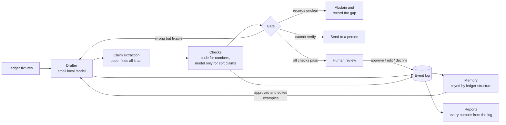

# BALANCECHECK

A drafting agent for accounts receivable that checks its own work, learns from every human decision, and proves the improvement with numbers.

## 1. What BALANCECHECK does

BALANCECHECK writes one kind of message: a reply to a client explaining what they owe.

A small language model writes the draft. Before the draft reaches a person, code reads it back and checks every amount, total, invoice number, date, and status against the ledger. If a claim is wrong, the system does not send the draft. It either sends the draft back to the model with the exact correction, refuses to draft at all, or hands the case to a person.

When a person reviews a draft, their decision is recorded: approve, edit, or decline. Those decisions are stored and used to write better drafts on the next run. A separate test harness then measures whether the drafts actually got better, and reports numbers instead of opinions.

So there are three jobs:

| Job | How it is done |
|---|---|
| Catch its own wrong drafts | Code checks every claim against the ledger. A fixed rule table picks the outcome. |
| Learn from humans | Every review decision is saved and fed back as retrieved examples. |
| Prove it improved | All numbers are regenerated from the event log by a report command. |

Two rules hold everywhere in the system:

1. The model never does arithmetic. Code computes every figure and puts it in the prompt. The model only writes the sentence around it.
2. No draft is ever sent automatically. The best outcome the agent can reach on its own is "ready for a person to review".

## 2. Architecture diagram



A larger step-by-step version of this diagram is kept as a separate file: [docs/system_flowchart.svg](docs/system_flowchart.svg). It adds the revision budget, the two different stop paths, and what each step actually reads and writes. It is generated by [docs/make_system_flowchart.py](docs/make_system_flowchart.py), so run `make diagram` to rebuild it.

The loop has six steps.

**1. Draft.** A small local model writes the reply. Every figure it needs (open amounts, totals, statuses) is computed by code first and passed in the prompt. The model copies those figures and explains them.

**2. Extract.** Code reads the draft back and pulls out every claim that can be checked: amounts, totals, invoice and payment references, dates, statuses. The extractor is tuned to flag too much rather than too little. If it sees something that looks like a claim but cannot work out what it refers to, the case goes to a person. It is never dropped quietly.

**3. Check.** Code compares every extracted claim against the ledger. Only soft claims, such as "as we discussed", go to a model verifier, and that verifier sees one sentence plus the matching records, never the rest of the draft. Two more checks look at the draft as a whole: the listed amounts must add up to the stated totals, and required content (the balance, the open invoices, any unapplied money) must actually be present.

**4. Decide.** A fixed rule table picks one of four outcomes:

| Outcome | When | What happens |
|---|---|---|
| Revise | A wrong claim can be corrected from the ledger | The draft goes back to the model with the exact correction |
| Abstain | The records cannot support any trustworthy draft | No draft is written, and the reason is logged as a capability gap |
| Escalate | A claim cannot be verified either way | A person is asked to look |
| Human gate | Every check passed | The draft is queued for human review |

**5. Learn.** Approved and edited drafts are stored in a memory keyed by the shape of the ledger case (unapplied cash, partial payment, open credit, and so on). The next run looks up the closest matching examples and puts them in the prompt. Evaluation scenarios sit in a separate pool that never enters memory, and a test enforces that split.

**6. Prove.** Every report is built only from the event log. Nothing is typed by hand.

## 3. Key design decisions

| Decision | Why |
|---|---|
| Money is stored as whole cents, never as a decimal number | Comparisons are exact and JSON round-trips without loss. Rounding bugs cannot happen. |
| Payment applications are their own record type | This makes unapplied cash, partial payments, and misapplied payments possible to represent. Those cases are where real accounts receivable goes wrong. |
| The model never calculates | Code computes every number before drafting and re-checks every number after. Nothing depends on the model getting maths right. |
| The model verifier sees one claim, not the draft | It gets a single sentence and the matching records, so the rest of the draft cannot talk it into agreeing. |
| A number with no clear owner is escalated | If an amount happens to match some unrelated ledger row, that is a coincidence, not proof. Coincidences go to a person. |
| Each claim is bound to a document and a role | The extractor records which invoice the number refers to and which figure it is (open, original, applied, or account total). The checker then verifies that exact figure instead of guessing from nearby words. |
| The evaluation has its own separate checker | An independently written grounding oracle shares no code with the gate, so a blind spot in the gate cannot hide inside the evaluation. |
| Calibration labels were written blind and committed first | The human labels were made on a shuffled set with the corruption map sealed, and committed before the judge was ever run. |
| Judge disagreements are counted as ties | Each pairwise comparison runs in both orders. If the two orders disagree, it counts as a tie, and the disagreement rate is reported. |

### What adversarial testing changed

Before the live runs, six independent reviewers attacked the system by executing it, not by reading it. The statistics code, the ledger arithmetic, and the decision table all held. The extraction layer did not: 18 of 23 crafted wrong drafts reached the human gate. Every one of those routes is now closed, and the whole attack set is a regression test in `tests/test_adversarial_regressions.py`. The re-measured escape rate is zero, and no correct sentence is now wrongly rejected.

The first live run then showed a harder case: drafts where every single claim is true but the draft as a whole misleads. One example listed the full original amounts of each invoice next to a correct, smaller total. Two whole-draft checks now catch this class, locked in by tests that replay the exact live escapes.

A later, deeper review found that those checks shared one root cause. The checkers were working out which invoice and which figure an amount referred to by looking at nearby words. That failed in both directions: a per-invoice amount was tested against the account total, a wrong amount was accepted because it happened to match the invoice's original amount, and a status word was applied to two invoices at once and produced claims nobody wrote. The fix was the binding change in the table above, covered by `tests/test_binding_regressions.py`.

The same review found three more problems, all now fixed:

| Problem | Fix |
|---|---|
| The revise-and-recheck path had never actually run end to end, because first drafts always passed | `tests/test_revise_loop_e2e.py` drives the loop through a real revision |
| The completeness score counted whether a word appeared, not whether a claim was verified | Completeness is now computed from verified claims in `bench/score.py` |
| The independent oracle existed but was never called by the harness | It now runs over every first-pass draft, and its result is reported |

## 4. Results at a glance

Every number in the grey blocks in this README is generated from the event log by `make report` and inserted by `make readme`. A test fails if any of them is edited by hand.

The headline test: 12 known errors were deliberately injected into drafts across four difficulty tiers, plus 5 clean drafts as controls. A tier passes only if the system catches the corrupted drafts and lets the clean ones through.

<!-- BC:BEGIN injected_errors -->
# Injected errors

## Tier 0 (clean controls: caught means falsely flagged)

| error_id | scenario | expected kind | expected action | decision | reason | caught | notes |
|---|---|---|---|---|---|---|---|
| E-CLEAN-S-A-01 | S-A-01 | none | human_gate | human_gate | all checks passed | no |  |
| E-CLEAN-S-A-02 | S-A-02 | none | human_gate | human_gate | all checks passed | no |  |
| E-CLEAN-S-A-03 | S-A-03 | none | human_gate | human_gate | all checks passed | no |  |
| E-CLEAN-S-A-04 | S-A-04 | none | human_gate | human_gate | all checks passed | no |  |
| E-CLEAN-S-A-05 | S-A-05 | none | human_gate | human_gate | all checks passed | no |  |

Tier 0: caught 0/5 (0%).

## Tier 1

| error_id | scenario | expected kind | expected action | decision | reason | caught | notes |
|---|---|---|---|---|---|---|---|
| E-T1-01-S-A-01 | S-A-01 | c_amt_or_sum_fail | revise_or_escalate | revise | correctable code-check failure | yes |  |
| E-T1-01-S-A-02 | S-A-02 | c_amt_or_sum_fail | revise_or_escalate | revise | correctable code-check failure | yes |  |
| E-T1-02-S-A-01 | S-A-01 | c_exist_fail | escalate | escalate | fabricated document reference | yes |  |
| E-T1-02-S-A-02 | S-A-02 | c_exist_fail | escalate | escalate | fabricated document reference | yes |  |
| E-T1-03-S-A-01 | S-A-01 | c_sum_fail | revise_or_escalate | revise | correctable code-check failure | yes |  |
| E-T1-03-S-A-02 | S-A-02 | c_sum_fail | revise_or_escalate | revise | correctable code-check failure | yes |  |

Tier 1: caught 6/6 (100%).

## Tier 2

| error_id | scenario | expected kind | expected action | decision | reason | caught | notes |
|---|---|---|---|---|---|---|---|
| T2-SUM-IGNORES-UNAPPLIED | S-A-02 | c_sum_or_amt_fail | revise_or_escalate | revise | correctable code-check failure | yes |  |
| T2-FULL-ORIGINAL-AMOUNTS | S-A-03 | c_sum_or_amt_fail | revise_or_escalate | revise | itemized amounts contradict the computed totals | yes |  |
| T2-CREDITS-ASSUMED-APPLIED | S-A-04 | c_sum_or_amt_fail | revise_or_escalate | revise | draft is missing required content | yes |  |

Tier 2: caught 3/3 (100%).

## Tier 3

| error_id | scenario | expected kind | expected action | decision | reason | caught | notes |
|---|---|---|---|---|---|---|---|
| E-T3-01 | S-A-06 | ambiguous_allocation | abstain_or_escalate | abstain | ambiguous allocation | yes |  |

Tier 3: caught 1/1 (100%).

## Tier 4

| error_id | scenario | expected kind | expected action | decision | reason | caught | notes |
|---|---|---|---|---|---|---|---|
| E-T4-S-A-01 | S-A-01 | fuzzy_unsupported | revise_or_escalate | revise | unsupported fuzzy claim | yes |  |
| E-T4-S-A-03 | S-A-03 | fuzzy_unsupported | revise_or_escalate | revise | unsupported fuzzy claim | yes |  |

Tier 4: caught 2/2 (100%).

## Balanced accuracy per tier

Raw accuracy would reward a rubber stamp (most claims in real drafts are true); balanced accuracy averages the catch rate on corrupted rows with the pass rate on the clean controls.

Tier 1: balanced accuracy 100% (catch rate 6/6 (100%), clean-pass rate 5/5 (100%)).
Tier 2: balanced accuracy 100% (catch rate 3/3 (100%), clean-pass rate 5/5 (100%)).
Tier 3: balanced accuracy 100% (catch rate 1/1 (100%), clean-pass rate 5/5 (100%)).
Tier 4: balanced accuracy 100% (catch rate 2/2 (100%), clean-pass rate 5/5 (100%)).
<!-- BC:END injected_errors -->

What the four tiers mean:

| Tier | The error that was injected |
|---|---|
| 0 | Nothing. These are clean drafts. Flagging one is a false alarm. |
| 1 | An obvious wrong number, a broken total, or an invoice number that does not exist |
| 2 | Every claim is true but the draft as a whole is misleading |
| 3 | The records themselves are unclear, so the correct answer is to refuse |
| 4 | A soft claim with nothing in the records to support it |

Balanced accuracy is reported instead of plain accuracy. Plain accuracy would reward a system that approves everything, because most claims in real drafts are true. Balanced accuracy averages the catch rate on bad drafts with the pass rate on clean ones, so approving everything scores 50 percent.

## 5. Learning and evaluation methodology

### How the learning loop works

The scenarios are split into two pools:

| Pool | Use | Rule |
|---|---|---|
| Pool A | Drafts are shown to a human, who approves, edits, or declines them. Those decisions become memory. | May be learned from |
| Pool B | Used only to measure whether drafts got better. | Never enters memory. A test enforces this. |

Memory is keyed by the shape of the ledger case, not by the client. A scenario with unapplied cash retrieves past examples that also had unapplied cash. This is why an edit made on one client can change the drafts for a client the system has never seen.

Three runs are compared on Pool B:

| Run | Memory used |
|---|---|
| pass1 | No memory. This is the "before". |
| pass2 | Structure-matched memory. This is the "after". |
| pass2R | Random memory. Same number of examples, chosen at random. |

pass2R is the control. Without it, any improvement could just be the effect of having extra text in the prompt. Comparing pass2 against pass2R isolates whether the retrieval rule itself is doing work.

Scores are read on the first draft of each run, before any revision. Reading the final draft instead would hide the learning, because the revise loop removes number errors regardless of memory.

<!-- BC:BEGIN before_after -->
# Before/after: first-pass drafts, code-computed

Scores are read on first-pass drafts (stage first_pass), before any
revision, because the revise loop scrubs numeric errors and a
final-stage read would mask learning.

## Per pass

| pass | scenarios | grounding | completeness | revisions (total/scenarios) | terminal actions |
|---|---|---|---|---|---|
| pass1 | 6 | 36/36 (100%) | 12/12 (100%) | 0/6 | human_gate: 5, abstain: 1 |
| pass2 | 6 | 58/58 (100%) | 12/12 (100%) | 0/6 | human_gate: 5, abstain: 1 |
| pass2R | 6 | 56/56 (100%) | 12/12 (100%) | 0/6 | human_gate: 5, abstain: 1 |

## Paired per scenario: pass1 vs pass2

| scenario | grounding pass1 -> pass2 | delta (pp) | completeness pass1 -> pass2 | delta (pp) | revisions pass1 -> pass2 | delta |
|---|---|---|---|---|---|---|
| S-B-01 | 6/6 (100%) -> 10/10 (100%) | 0 | 2/2 (100%) -> 2/2 (100%) | 0 | 0 -> 0 | 0 |
| S-B-02 | 8/8 (100%) -> 13/13 (100%) | 0 | 3/3 (100%) -> 3/3 (100%) | 0 | 0 -> 0 | 0 |
| S-B-03 | 6/6 (100%) -> 12/12 (100%) | 0 | 2/2 (100%) -> 2/2 (100%) | 0 | 0 -> 0 | 0 |
| S-B-04 | 10/10 (100%) -> 13/13 (100%) | 0 | 3/3 (100%) -> 3/3 (100%) | 0 | 0 -> 0 | 0 |
| S-B-05 | 6/6 (100%) -> 10/10 (100%) | 0 | 2/2 (100%) -> 2/2 (100%) | 0 | 0 -> 0 | 0 |
| S-B-06 | 0/0 (n/a) -> 0/0 (n/a) | n/a | 0/0 (n/a) -> 0/0 (n/a) | n/a | 0 -> 0 | 0 |

n = 6 paired scenarios. n is too small for a significance claim; deltas are directional.

## Directional: the behaviours the Pool A edits targeted

Each behaviour is a code-derived check over the first-pass draft
(the client name, the issue and due dates of every open invoice, an
in-place explanation of unapplied items, a reconciliation invite), not
a fixed golden phrase. A behaviour that cannot apply to a scenario (no
unapplied item) is excluded from that scenario's denominator. The pass2R
column is the random-memory ablation: relevant retrieval versus arbitrary
examples, the comparison that isolates the retrieval function.

| behaviour | pass1 | pass2 | pass2R |
|---|---|---|---|
| greets the client by name | 0/5 | 5/5 | 5/5 |
| itemizes open invoices with issue and due dates | 0/5 | 5/5 | 5/5 |
| explains unapplied cash or credit in place | 0/2 | 2/2 | 1/2 |
| invites reconciliation in the closing | 4/5 | 5/5 | 5/5 |

| measure | pass1 | pass2 | pass2R |
|---|---|---|---|
| mean first-pass draft length (chars) | 429 | 637 | 599 |
<!-- BC:END before_after -->

How to read that:

- The grounding and completeness rates were already at 100 percent before learning, so they had no room to rise. That is expected: code computes the figures, so the drafter rarely gets one wrong.
- What did move is the number of verified claims per draft, shown in the grounding counts. The second batch of drafts says more, and all of it still checks out.
- The behaviour table is the real result. The three behaviours the human edits asked for went from almost never to always, on scenarios the memory had never seen.
- The random-memory control (pass2R) matched pass2 on the easy behaviours but not on explaining unapplied items in place, which is the behaviour that depends on retrieving a structurally similar case.
- Draft length is reported because the after-drafts are longer. That matters for the judge result below.

### How the judge is evaluated

A language model judge scores drafts, but it is never trusted with numbers. Grounding is always checked by code. The judge only rates things code cannot: tone, clarity, and an overall accept or reject.

Because the judge is a model, it is itself measured. 16 drafts were labelled by hand, blind, with the corruption map sealed, and the labels were committed before the judge ran. Agreement is reported as Cohen's kappa with a bootstrap confidence interval.

<!-- BC:BEGIN calibration -->
# Judge calibration

| dimension | kappa | 95% CI (bootstrap) | PABAK | raw agreement |
|---|---|---|---|---|
| acceptable (accept/reject) | 0.746 | [0.347, 1.000] | 0.750 | 0.875 |
| tone (1-4, weighted) | 0.091 | [-0.306, 0.636] | n/a | 0.688 |
| clarity (1-4, weighted) | 0.267 | [-0.065, 0.649] | n/a | 0.562 |

By draft class: clean subset kappa 0.600 (n=8, raw 0.875); corrupted subset kappa 0.000 (n=8, raw 0.875). The corrupted-subset kappa is 0 by the constant-rater degeneracy (every corrupted draft is labelled not-acceptable), which is exactly why raw agreement and PABAK are reported alongside kappa.

What this measures: the acceptable dimension is the holistic accept-or-reject call (tone and completeness together), NOT grounding, which is checked by code. Kappa on n=16 carries a wide CI (its upper bound touches 1.0 as a small-sample bootstrap boundary artifact) and is a calibration signal, not a certification.
<!-- BC:END calibration -->

This shape was predicted before the numbers were measured: agreement is decent on the accept-or-reject call and poor on taste. Both disagreements on the accept call were the judge being wrong, not the human. In one it missed an unsupported claim, in the other it invented a problem in a correct draft. That is the reason nothing in this system lets the judge near arithmetic.

Kappa can be misleading when one label dominates, which is what the corrupted subset shows: every corrupted draft is rejected by both raters, so kappa is 0 even though they agree 7 times out of 8. Raw agreement and PABAK are printed next to kappa for exactly this reason.

### Does a judge prefer the after-drafts?

Each pass1 draft is compared against its pass2 counterpart, twice: once with pass1 shown first, once with pass2 shown first. If the two orders disagree, it is counted as a tie.

<!-- BC:BEGIN pairwise -->
# Pairwise: pass1 vs pass2 first drafts, both orderings

| outcome | count |
|---|---|
| pass2 wins (verdict b) | 5 |
| ties | 0 |
| pass1 wins (verdict a) | 0 |

Decisive pairs: 5/5 (100%).
inconsistency rate (an upper bound on position bias): 0/5 (0%)

Position bias is the defended failure mode (both orderings, ties on disagreement). Length bias is NOT defended here: the after-drafts are systematically longer (see the draft-length row in the before/after report), so this pairwise preference is confounded with length. The primary before/after evidence is therefore the code-grounded first-pass metric, not this judged preference.
<!-- BC:END pairwise -->

One bias is defended and one is not, and the difference is stated openly. Running both orders defends against position bias, which is a judge preferring whichever draft it sees first. It does not defend against length bias. The after-drafts are longer, and judges tend to prefer longer text. So this result supports the main finding but is not the main finding. The code-computed behaviour table above is.

### Do two independent checkers agree?

The evaluation harness contains a second grounding checker, called the oracle. It shares no code with the gate. It reads the raw fixture and parses the draft with its own logic. If both agree that a draft is clean, that is real independent confirmation. If they disagree, that is a finding.

<!-- BC:BEGIN oracle_crosscheck -->
# Independent oracle cross-check

The grounding oracle shares no code with the gate's checkers (it
replays the raw fixture and reads the draft with its own parsers). It
is run over every first-pass draft; agreement is a real independent
confirmation, and any disagreement is a finding, not a shared blind
spot.

Drafts cross-checked: 20. Gate and oracle agree on the
clean-or-not verdict: 20/20 (100%).

No disagreements: the two independent paths concur on every draft.
<!-- BC:END oracle_crosscheck -->

During the live run this cross-check did find something. The oracle failed to recognise one figure, an invoice's applied amount inside a partial-payment breakdown. That was a gap in the oracle, and it is now fixed. Surfacing that kind of thing is the whole reason a second independent checker exists.

## 6. Agentic recovery ablation

The main loop uses one cheap model call per draft, over figures code has already computed. That is the fast path and it is the default.

There is an optional second path, switched on with `BC_REVISION_MODE=agentic`. It spends more model effort, and only after the gate has already found a fixable error. In that mode the model may call six read-only accounting tools to look up ledger evidence for itself:

| Tool | Returns |
|---|---|
| account summary | The client's overall balance position |
| open invoices | The list of invoices still open |
| get invoice | One invoice by number |
| unapplied sources | Payments and credits not yet applied |
| get source | One payment or credit by number |
| application history | Which payment was applied to which invoice |

The limits are hard:

| Limit | Value |
|---|---|
| Recoveries per scenario | 1 |
| Model calls in the recovery | 3 |
| Tool executions in the recovery | 6 |
| If the recovery still fails | Escalate to a person, never retry |

The agent cannot approve, send, or decide anything. Its rewritten draft goes back through the same extraction, the same checks, and the same gate. Human review is still the only successful ending. Every tool call is written to the event log as a typed event.

The ablation below took the same set of failed first drafts and revised each one twice: once with the plain prompt backend (one model call carrying the gate's correction) and once with the agentic backend. The same verifier judged both.

<!-- BC:BEGIN agentic_recovery -->
# Agentic recovery ablation

Identical correctable first drafts were revised once by the prompt
backend (one LLM call carrying the gate's correction) and once by the
bounded agentic backend (up to three LLM calls and six read-only tool
calls); the same extract, check, and decide pipeline judged both. The
agent never approves its own work and HUMAN_GATE remains the only
successful terminal state.

| case | failure | prompt arm | agentic arm | agent LLM calls | tool calls | forced final |
|---|---|---|---|---|---|---|
| swap_amount-S-A-01 | swap_amount | recovered | recovered | 2 | 3 | no |
| break_sum-S-A-01 | break_sum | recovered | recovered | 2 | 2 | no |
| swap_amount-S-A-02 | swap_amount | recovered | recovered | 3 | 4 | yes |
| break_sum-S-A-02 | break_sum | recovered | recovered | 2 | 3 | no |
| swap_amount-S-A-03 | swap_amount | recovered | recovered | 2 | 3 | no |
| break_sum-S-A-03 | break_sum | recovered | recovered | 2 | 2 | no |
| swap_amount-S-A-04 | swap_amount | recovered | recovered | 3 | 4 | yes |
| break_sum-S-A-04 | break_sum | recovered | recovered | 2 | 3 | no |
| swap_amount-S-A-05 | swap_amount | recovered | recovered | 2 | 3 | no |
| break_sum-S-A-05 | break_sum | recovered | recovered | 2 | 2 | no |
| credit_omitted-S-A-04 | credit_omitted | recovered | recovered | 2 | 3 | no |
| unapplied_omitted-S-A-02 | unapplied_omitted | recovered | recovered | 2 | 3 | no |
| full_amounts-S-A-03 | itemization_full_amounts | recovered | recovered | 2 | 2 | no |

Recovery rate: prompt 13/13 (100%), agentic 13/13 (100%).
Agentic cost: 28 agent LLM calls and 37 tool calls across 13 recoveries (2.1 calls and 2.8 tools per recovery on average).
Forced-final rate: 2/13 (15%). A forced final means the model used both tool rounds without returning an acceptable final draft, so the guaranteed third call was made to extract it. It does NOT by itself mean the evidence was missing (see the next line).
Coverage-forced rate: 0/13 (0%). This counts recoveries where the model failed to gather a REQUIRED tool result and the orchestrator executed it deterministically; it is the honest measure of how much of the agency is the model's own. Of the forced finals, 2 had gathered all required evidence themselves (coverage-forced zero) and simply used the full round budget before finalizing.
Cost framing: the prompt arm spends 1 LLM call per recovery; the agentic arm spent 2.1 on average plus tools. The fast path (a clean first draft) uses one call and zero tools in both modes.
<!-- BC:END agentic_recovery -->

The honest reading: giving the model tools did not raise the recovery rate. Both backends fixed every case. The agentic arm just cost about twice as many model calls plus tool calls to reach the same place.

That is a real result, not a failure. It says the gate's corrections are precise enough that the model does not need to go looking for evidence. Tool access is worth keeping for cases where the correction cannot be stated as precisely, but on this workload it buys nothing measurable, and the report says so.

Two numbers in that table sound similar and mean different things. Do not mix them up:

| Number | Meaning |
|---|---|
| Forced final | The model used both tool rounds without producing an acceptable draft, so the guaranteed last call was made to get one. It may still have collected all the evidence it needed. |
| Coverage forced | The model failed to fetch a required piece of evidence, so the orchestrator fetched it deterministically. This is the honest measure of how much of the work was really the model's. |

The tool ceiling also binds those deterministic fetches, so a recovery can never exceed its tool budget. If required evidence still cannot be gathered, the recovery escalates to a person rather than accepting an unsupported draft.

## 7. Limitations

### Assumptions

- The ledger is treated as true. This system checks drafts against the ledger. It does not audit the ledger. A wrong figure in the fixtures would fool the gate and the oracle together, because they share the fixture even though they share no code.
- The output is a short prose email. The extractor is tuned for that format: one document per bullet, standard ID formats, dollar amounts, ISO dates. A very different format would need wider detection patterns.
- The drafter is only asked to copy and explain figures, never to calculate. The design assumes a small model can do that. It does not assume the model can do maths.
- The judge only rates what code cannot rate. Grounding is never handed to it.
- The calibration and before/after runs are single samples at temperature zero on a small held-out pool. They show direction, not statistical significance.

### What was cut

- Only one artifact type is built: the balance-due client reply. The account summary and document follow-up artifacts were cut. They add volume but no new kind of verification.
- The drafter self-report channel, where the model lists its own claims for cross-checking, is designed but not built. Code extraction is what enforces correctness, so the less reliable path was left off the critical route.
- Declined drafts are recorded but not yet used as negative examples.
- There is no fine-tuning run. The captured decisions are the data one would fine-tune on. Retrieval is the version that shipped.
- No multi-currency, no manual journal entries, no control-account tie-out.

### Where this could mislead you

- **The extractor is the weakest part.** It is built to over-detect, and anything it detects but cannot resolve gets escalated. But a claim phrased in a way it does not flag at all is invisible to every check downstream. The adversarial corpus bounds this for phrasings that have been seen. It says nothing about phrasings that have not.
- **A draft can be true and still misleading.** The whole-draft checks catch inconsistent itemisations and missing content. They cannot catch a draft that misleads by emphasis or by leaving out context that no checklist names. One live example of this class is caught. The class in general is not closable at the claim level.
- **The calibration is a signal, not a certificate.** 16 items, labelled by one person, who is also the person who built the system. The confidence interval is wide and is printed next to the number.
- **The before and after runs are small.** Six held-out scenarios, one sample each. The claim rests on the direction being the same across every instrument (claim count, behaviour markers, judge preference), not on statistical significance.
- **Synthetic books are clean books.** No OCR noise, no mid-period corrections, no disputed invoices. Every catch rate here is a best case, not an expected real-world rate.

### Further ideas I would like to explore

There are a few areas where I would like to take this project further:

* **Improve claim extraction.** The current extractor uses hand-written patterns. I would add a second lightweight model that only identifies numbers, dates and document references in the draft. It would not verify anything, but it could highlight claims that the code extractor may have missed.
* **Measure extractor coverage.** I would compare the claims found by the code extractor and the model-based extractor. Any disagreement could become either a new extraction rule or a clearly documented limitation.
* **Turn repeated edits into drafting rules.** At the moment, approved and edited replies are stored as examples. If the same correction appears several times, the system could promote it into a permanent drafting instruction instead of relying on retrieval every time.
* **Turn repeated gaps into tool requests.** When the same missing information repeatedly causes abstention or escalation, the system could suggest a new tool or integration that would help resolve it.
* **Test on harder and more realistic records.** The current fixtures are controlled and synthetic. A useful next step would be testing the system with noisier records, disputed invoices, corrections and incomplete payment references.

### Gaps I would love to work on in future

These are some broader ideas that came out of building the system:

* **Use capability gaps as a product roadmap.** Every abstention already records what was missing and what could have helped. Across many clients, these records could show which integration or feature would create the most value.
* **Use recurring human edits as team knowledge.** Common reviewer corrections could gradually become shared drafting guidance, so the system improves from the decisions of the whole accounting team.
* **Create automatic requests for missing information.** For example, if payments repeatedly arrive without an invoice reference, the system could prepare a message asking the client which invoice the payment should be applied to.
* **Build a reviewer dashboard.** A simple dashboard could show which drafts need attention, why they were stopped, which checks failed and which capability gaps occur most often.
* **Track improvement over a longer period.** Instead of comparing only two batches, the same evaluation could be repeated over several weeks to show whether the system continues to improve or reaches a plateau.

These ideas are not part of the current implementation, but they are natural extensions of the event log, human feedback and capability-gap data that the system already collects.

## 8. Running locally

No model and no credentials needed:

```bash
python3 -m venv .venv && ./.venv/bin/pip install -e ".[dev]"
make fixtures   # build the 12 synthetic client scenarios
make demo       # run the full draft-verify-decide loop in stub mode
make test       # 388 tests
```

The demo shows both ends of the loop. One clean scenario reaches the human gate. One scenario whose records are genuinely unclear is refused, and the agent records exactly what it would need in order to proceed.

To run against a real model:

```bash
cp .env.example .env   # point BC_BASE_URL at any OpenAI-compatible endpoint
source .env
make poolA             # run the learning pool
make review            # read pending drafts; apply decisions with review --apply
make pass1 ingest pass2 pass2r
make errors            # the injected-error suite
make bench-select      # blind calibration set; label it, commit labels, then:
make bench-judge bench-agree bench-pairwise
make report readme
```

All client data is synthetic. No real client data is used anywhere in this repository.

Developed against a self-hosted Qwen3.6-35B-A3B (about 3 billion active parameters) served with vLLM. The design does not depend on a frontier model. Every check that carries trust is code. A larger model would only improve drafting style, not verification.

## 9. Full generated evidence

Everything below is produced from the append-only event log. `make report` regenerates it, and a test compares the regenerated output against what is committed here, so hand-edited numbers fail the build.

### Where the agent is blind

Every abstention records why. These records are a product backlog, not log noise.

<!-- BC:BEGIN capability_gaps -->
# Capability gaps

| category | count | gen_ids |
|---|---|---|
| allocation_reference | 5 | errors-S-A-06-r0, poolA-S-A-06-r0, pass1-S-B-06-r0, pass2-S-B-06-r0, pass2R-S-B-06-r0 |

Total capability gaps: 5.
<!-- BC:END capability_gaps -->

Five abstentions all trace to the same cause: a payment arrived with no indication of which invoice it pays. The fix is not a model change. It is asking clients to send remittance advice.

### Model call reliability

<!-- BC:BEGIN trace_stats -->
# Trace stats

| task | attempts | ok | ok rate |
|---|---|---|---|
| draft | 23 | 23 | 100% |
| judge_pairwise | 10 | 10 | 100% |
| judge_rubric | 16 | 16 | 100% |
| verify_fuzzy | 2 | 2 | 100% |

Structured-parse failures: 0
Total trace lines: 51
<!-- BC:END trace_stats -->

Zero malformed responses across every judge and verifier call. Structured outputs use JSON-schema constrained decoding at the endpoint, which makes malformed JSON very unlikely at the decoder itself. A validate-and-retry fallback sits behind that in the client. It was never needed.

### What is held fixed between runs

The before and after runs differ in exactly one thing: the memory snapshot and the retrieved examples it produces. The model, the seed, the evaluation fixtures, the static prompt files, and the configuration are all held fixed, and every run manifest records them. The manifests also record the run id, the pass label, and the retrieval mode, which necessarily differ between runs.

The model is pinned by the identifier the endpoint serves. That endpoint does not expose a content digest, so this is an identifier, not a hash. It is a weaker guarantee than a hash and is stated as such.

## References

| Paper | Authors | Venue | Why it matters here |
|---|---|---|---|
| MiniCheck: Efficient Fact-Checking of LLMs on Grounding Documents | Tang, Laban, Durrett | EMNLP 2024 | Motivates checking each claim against evidence and reporting balanced accuracy. BALANCECHECK replaces the learned fact-checker with deterministic ledger checks wherever the claim can be computed. |
| FActScore: Fine-grained Atomic Evaluation of Factual Precision in Long Form Text Generation | Min et al. | EMNLP 2023 | Motivates splitting generated text into individually checkable claims and measuring what share of them a trusted source supports. |
| Chain-of-Verification Reduces Hallucination in Large Language Models | Dhuliawala et al. | Findings of ACL 2024 | Motivates keeping verification separate from generation. The fuzzy verifier here sees one claim and the matching records, never the surrounding draft. |
| G-Eval: NLG Evaluation using GPT-4 with Better Human Alignment | Liu et al. | EMNLP 2023 | Motivates structured LLM evaluation with separate criteria. The judge emits schema-constrained scores for tone, clarity, and overall acceptability. |
| Judging LLM-as-a-Judge with MT-Bench and Chatbot Arena | Zheng et al. | NeurIPS 2023, Datasets and Benchmarks Track | Motivates testing both presentation orders in pairwise judging and treating an order-dependent disagreement as a tie rather than a real preference. |
| Evaluating Evaluation Metrics: The Mirage of Hallucination Detection | Kulkarni et al. | Findings of EMNLP 2025 | Motivates temperature-zero decoding, caution about cheap automatic faithfulness metrics, and calibrating the LLM judge against human labels. |
| SelfCheckGPT: Zero-Resource Black-Box Hallucination Detection for Generative Large Language Models | Manakul, Liusie, Gales | EMNLP 2023 | The sampling-based self-consistency approach used here as a contrast. BALANCECHECK does not infer truth from agreement between repeated generations. |
| Too Consistent to Detect: A Study of Self-Consistent Errors in LLMs | Tan et al. | EMNLP 2025 | Shows that confidently repeated errors can slip past consistency-based detectors. This supports checking every computable claim against external ledger truth instead. |
