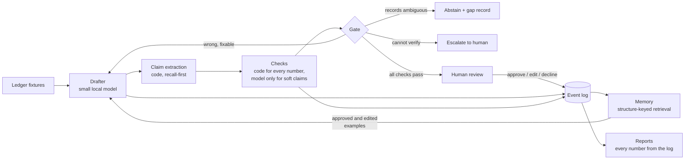

# BALANCECHECK

A drafting agent for accounts receivable that checks its own work, learns from every human decision, and proves the improvement with numbers.

It drafts client replies that explain a balance due. Before any draft reaches a human, code checks every number, date, document reference, and status claim in it against the ledger. Every human decision (approve, edit, decline) becomes memory that changes the next batch of drafts. An evaluation harness measures whether the drafts actually got better, with a judge that is itself calibrated against human labels.

## Quick start (no model, no credentials)

```bash
python3 -m venv .venv && ./.venv/bin/pip install -e ".[dev]"
make fixtures   # build the 12 synthetic client scenarios
make demo       # run the full draft-verify-decide loop in stub mode
make test       # 296 tests
```

The demo shows the two ends of the loop: a clean scenario reaches the human gate, and a scenario whose records are genuinely ambiguous is refused (the agent abstains and records exactly what it would need to proceed).

## Results at a glance

Every number in the blocks below is generated from the event log by `make report` and injected by `make readme`. A test fails if any of them is edited by hand.

### Did the verifier catch injected errors?

<!-- BC:BEGIN injected_errors -->
# Injected errors

## Tier 0 (clean controls: caught means falsely flagged)

| error_id | scenario | expected kind | expected action | decision | reason | caught | notes |
|---|---|---|---|---|---|---|---|
| E-CLEAN-S-A-01 | S-A-01 | none | human_gate | human_gate | all checks passed | no |  |
| E-CLEAN-S-A-02 | S-A-02 | none | human_gate | human_gate | all checks passed | no |  |
| E-CLEAN-S-A-03 | S-A-03 | none | human_gate | human_gate | all checks passed | no |  |
| E-CLEAN-S-A-04 | S-A-04 | none | human_gate | human_gate | all checks passed | no |  |
| E-CLEAN-S-A-05 | S-A-05 | none | human_gate | human_gate | all checks passed | no |  |

Tier 0: caught 0/5 (0%).

## Tier 1

| error_id | scenario | expected kind | expected action | decision | reason | caught | notes |
|---|---|---|---|---|---|---|---|
| E-T1-01-S-A-01 | S-A-01 | c_amt_or_sum_fail | revise_or_escalate | revise | correctable code-check failure | yes |  |
| E-T1-01-S-A-02 | S-A-02 | c_amt_or_sum_fail | revise_or_escalate | revise | correctable code-check failure | yes |  |
| E-T1-02-S-A-01 | S-A-01 | c_exist_fail | escalate | escalate | fabricated document reference | yes |  |
| E-T1-02-S-A-02 | S-A-02 | c_exist_fail | escalate | escalate | fabricated document reference | yes |  |
| E-T1-03-S-A-01 | S-A-01 | c_sum_fail | revise_or_escalate | revise | correctable code-check failure | yes |  |
| E-T1-03-S-A-02 | S-A-02 | c_sum_fail | revise_or_escalate | revise | correctable code-check failure | yes |  |

Tier 1: caught 6/6 (100%).

## Tier 2

| error_id | scenario | expected kind | expected action | decision | reason | caught | notes |
|---|---|---|---|---|---|---|---|
| T2-SUM-IGNORES-UNAPPLIED | S-A-02 | c_sum_or_amt_fail | revise_or_escalate | revise | correctable code-check failure | yes |  |
| T2-FULL-ORIGINAL-AMOUNTS | S-A-03 | c_sum_or_amt_fail | revise_or_escalate | revise | itemized amounts contradict the computed totals | yes |  |
| T2-CREDITS-ASSUMED-APPLIED | S-A-04 | c_sum_or_amt_fail | revise_or_escalate | revise | draft is missing required content | yes |  |

Tier 2: caught 3/3 (100%).

## Tier 3

| error_id | scenario | expected kind | expected action | decision | reason | caught | notes |
|---|---|---|---|---|---|---|---|
| E-T3-01 | S-A-06 | ambiguous_allocation | abstain_or_escalate | abstain | ambiguous allocation | yes |  |

Tier 3: caught 1/1 (100%).

## Tier 4

| error_id | scenario | expected kind | expected action | decision | reason | caught | notes |
|---|---|---|---|---|---|---|---|
| E-T4-S-A-01 | S-A-01 | fuzzy_unsupported | revise_or_escalate | revise | unsupported fuzzy claim | yes |  |
| E-T4-S-A-03 | S-A-03 | fuzzy_unsupported | revise_or_escalate | revise | unsupported fuzzy claim | yes |  |

Tier 4: caught 2/2 (100%).

## Balanced accuracy per tier

Raw accuracy would reward a rubber stamp (most claims in real drafts are true); balanced accuracy averages the catch rate on corrupted rows with the pass rate on the clean controls.

Tier 1: balanced accuracy 100% (catch rate 6/6 (100%), clean-pass rate 5/5 (100%)).
Tier 2: balanced accuracy 100% (catch rate 3/3 (100%), clean-pass rate 5/5 (100%)).
Tier 3: balanced accuracy 100% (catch rate 1/1 (100%), clean-pass rate 5/5 (100%)).
Tier 4: balanced accuracy 100% (catch rate 2/2 (100%), clean-pass rate 5/5 (100%)).
<!-- BC:END injected_errors -->

### Did the drafts improve after learning?

<!-- BC:BEGIN before_after -->
# Before/after: first-pass drafts, code-computed

Scores are read on first-pass drafts (stage first_pass), before any
revision, because the revise loop scrubs numeric errors and a
final-stage read would mask learning.

## Per pass

| pass | scenarios | grounding | completeness | mean revisions | terminal actions |
|---|---|---|---|---|---|
| pass1 | 6 | 36/36 (100%) | 12/15 (80%) | 0/6 | human_gate: 5, abstain: 1 |
| pass2 | 6 | 62/62 (100%) | 12/15 (80%) | 0/6 | human_gate: 5, abstain: 1 |
| pass2R | 6 | 55/55 (100%) | 12/15 (80%) | 0/6 | human_gate: 5, abstain: 1 |

## Paired per scenario: pass1 vs pass2

| scenario | grounding pass1 -> pass2 | delta (pp) | completeness pass1 -> pass2 | delta (pp) | revisions pass1 -> pass2 | delta |
|---|---|---|---|---|---|---|
| S-B-01 | 6/6 (100%) -> 11/11 (100%) | 0 | 2/2 (100%) -> 2/2 (100%) | 0 | 0 -> 0 | 0 |
| S-B-02 | 8/8 (100%) -> 13/13 (100%) | 0 | 3/3 (100%) -> 3/3 (100%) | 0 | 0 -> 0 | 0 |
| S-B-03 | 6/6 (100%) -> 12/12 (100%) | 0 | 2/2 (100%) -> 2/2 (100%) | 0 | 0 -> 0 | 0 |
| S-B-04 | 10/10 (100%) -> 13/13 (100%) | 0 | 3/3 (100%) -> 3/3 (100%) | 0 | 0 -> 0 | 0 |
| S-B-05 | 6/6 (100%) -> 13/13 (100%) | 0 | 2/2 (100%) -> 2/2 (100%) | 0 | 0 -> 0 | 0 |
| S-B-06 | 0/0 (n/a) -> 0/0 (n/a) | n/a | 0/3 (0%) -> 0/3 (0%) | 0 | 0 -> 0 | 0 |

n = 6 paired scenarios. n is too small for a significance claim; deltas are directional.

## Directional: the behaviors the Pool A edits targeted

Rates over first-pass Pool B drafts; each marker is a deterministic
string check named in the generator, not a judged quality.

| behavior | pass1 | pass2 |
|---|---|---|
| greets the client by name | 0/5 | 5/5 |
| itemizes with issue and due dates | 0/5 | 5/5 |
| explains unapplied items in place | 0/5 | 1/5 |
| invites reconciliation in the closing | 0/5 | 5/5 |
<!-- BC:END before_after -->

The headline is in the last two tables. The aggregate score was already at the ceiling before learning (the drafter transcribes numbers that code computes, so its figures are usually right). What moved is what the human edits asked for: the second batch of drafts adopted the edited style on scenarios the memory had never seen, and carried 36 verified claims before learning versus 62 after, at the same 100 percent pass rate. Richer drafts, still fully grounded.

### Does a judge prefer the after-drafts?

<!-- BC:BEGIN pairwise -->
# Pairwise: pass1 vs pass2 first drafts, both orderings

| outcome | count |
|---|---|
| pass2 wins (verdict b) | 5 |
| ties | 0 |
| pass1 wins (verdict a) | 0 |

Decisive pairs: 5/5 (100%).
inconsistency rate (an upper bound on position bias): 0/5 (0%)
<!-- BC:END pairwise -->

### Can the judge be trusted?

<!-- BC:BEGIN calibration -->
# Judge calibration

| field | value |
|---|---|
| acceptable | {"kappa": 0.746031746031746, "kappa_ci": [0.3469387755102041, 1.0], "pabak": 0.75, "raw_agreement": 0.875} |
| clarity | {"raw_agreement": 0.375, "weighted_kappa": 0.15384615384615385, "weighted_kappa_ci": [-0.18683035714285715, 0.5140992587818236]} |
| clean_subset | {"binary_kappa": null, "n": 8} |
| corrupted_subset | {"binary_kappa": null, "n": 8} |
| n | 16 |
| n_judged | 16 |
| n_labeled | 16 |
| tone | {"raw_agreement": 0.6875, "weighted_kappa": 0.2592592592592593, "weighted_kappa_ci": [-0.17647058823529416, 0.7377049180327868]} |

Kappa on n=16 carries a wide CI and is a calibration signal, not a certification.
<!-- BC:END calibration -->

The shape was predicted before measuring: agreement is high on the grounded accept-or-reject call and low on taste (tone, clarity). Both disagreements on the accept call were the judge being wrong, not the human: it missed an unsupported claim in one draft and invented a problem in a correct one. That is why nothing in this system trusts the judge with arithmetic.

### Where is the agent blind?

<!-- BC:BEGIN capability_gaps -->
# Capability gaps

| category | count | gen_ids |
|---|---|---|
| allocation_reference | 5 | errors-S-A-06-r0, poolA-S-A-06-r0, pass1-S-B-06-r0, pass2-S-B-06-r0, pass2R-S-B-06-r0 |

Total capability gaps: 5.
<!-- BC:END capability_gaps -->

Every abstention names its category. Five abstentions tracing to missing allocation references is a product backlog item (request remittance advice from clients), not a log curiosity.

### Model calls

<!-- BC:BEGIN trace_stats -->
# Trace stats

| task | attempts | ok | ok rate |
|---|---|---|---|
| draft | 23 | 23 | 100% |
| judge_pairwise | 10 | 10 | 100% |
| judge_rubric | 16 | 16 | 100% |
| verify_fuzzy | 2 | 2 | 100% |

Structured-parse failures: 0
Total trace lines: 51
<!-- BC:END trace_stats -->

Zero structured-parse failures across every judge and verifier call: structured outputs use JSON-schema constrained decoding at the endpoint, so malformed JSON is impossible at the decoder rather than retried after the fact.

## How it works



One artifact type, complete: the balance-due client reply. The loop is:

1. **Draft.** A small local model writes the reply. Every figure it needs (open amounts, totals, statuses) is computed by code and handed to it in the prompt. The model transcribes and explains; it never does arithmetic.
2. **Extract.** Code re-reads the draft and pulls out every checkable claim: amounts, totals, document references, dates, statuses. The extractor is built to over-detect. Anything it detects but cannot pin down is escalated, never silently dropped.
3. **Check.** Every extracted claim is verified against the ledger by code. Only soft claims (things like "as we discussed") go to a model verifier, which sees one sentence and the records, never the rest of the draft. Two aggregate checks then look at the draft as a whole: the itemized amounts must be consistent with the totals, and required content (the balance, the open invoices, any unapplied money) must actually be present.
4. **Decide.** A fixed rule table picks one of four outcomes: revise (with the exact correction), abstain (the records cannot support any trustworthy draft), escalate (a human must look), or pass to the human gate. Nothing is ever auto-sent.
5. **Learn.** Approved and edited drafts enter a memory keyed by ledger structure (unapplied cash, partial payments, open credits, and so on). The next run retrieves the most relevant examples into the prompt. Evaluation scenarios are a held-out pool that never enters memory, enforced by test.
6. **Prove.** Reports are generated only from the event log. The before and after runs differ by exactly one thing, the memory state, and the run manifests show it as a two-line diff.

## What the red team changed

Before the live runs, six reviewers attacked the system by executing it. The statistics, the ledger arithmetic, and the decision table held. The extraction layer did not: 18 of 23 crafted wrong drafts initially walked through to the human gate. Every escape path was closed and the full attack corpus is now a regression test (`tests/test_adversarial_regressions.py`); the re-measured escape rate is zero, with no true sentence wrongly condemned. The second live run then exposed a subtler class, drafts made only of true claims that mislead as a whole (a correct total beside an itemization that contradicts it; a credit memo silently omitted). Two aggregate gate checks now catch both, locked in by tests that reproduce the exact live escapes.

## Design decisions worth defending

| Decision | Why |
|---|---|
| Money is integer cents everywhere | Exact equality, lossless JSON, and the oldest bug class in accounting software removed by a type |
| Applications are first-class records | Unapplied cash, partial payments, and misapplied payments become representable, and they are where real AR breaks live |
| The model never does arithmetic | Every number is computed by code before drafting and checked by code after; the design does not lean on model correctness |
| The verifier sees claims, not drafts | The model verifier gets one sentence plus its records, so it cannot be swayed by the surrounding text |
| An unattributable number escalates | A bare amount matching some unrelated ledger row is not support; coincidence is not verification |
| The eval has its own oracle | The harness grounds drafts with an independently written checker that shares no code with the gate, so a gate blind spot cannot hide in the eval |
| Blind labels, committed first | The calibration labels were written against a shuffled set with the corruption map sealed, and committed before the judge ever ran |
| Judge disagreements count as ties | The pairwise comparison runs in both orders; any flip is a tie, and the flip rate is reported as an upper bound on position bias |

## What was cut, and said so

- One artifact type. The account summary and document follow-up artifacts (and their request-list fixtures) are cut; they add volume, not new verification classes.
- The drafter self-report channel (the model listing its own claims for cross-checking) is designed but not shipped; surface extraction is the enforcement, and the flaky path stays off the critical path.
- Declined drafts are captured but not consumed as negative examples in v1.
- No fine-tune run; the captured decisions form the preference data one would consume, and the retrieval memory is the shipped consumption mechanism.
- No multi-currency, no manual journal entries, no control-account tie-out.

## Where this would mislead you

- **The extractor is the soft underbelly.** Recall-first detection plus escalate-on-unparseable converts most misses into escalations, but a quantitative claim phrased in a way the detector does not flag at all is invisible. The red-team corpus bounds this against known phrasings; novel prose is not covered.
- **Framing can lie while claims are true.** The aggregate checks catch inconsistent itemizations and missing content, but a draft can still mislead by emphasis or by omitting context no checklist names. One live example (full original amounts presented as owed, beside a correct total) is caught; the general class is not closable at claim level.
- **The calibration is a signal, not a certification.** Sixteen items, one labeler who also built the system. The confidence interval on the agreement number is wide and reported next to it.
- **The before and after runs are small.** Six held-out scenarios, one sample each at temperature zero. The direction is consistent across every instrument (claim density, style markers, judge preference), which is the honest basis of the claim, not statistical significance.
- **Synthetic books are clean books.** No OCR noise, no mid-period corrections, no disputed invoices. Every catch rate here is an upper bound on real-world performance.

## If I had another day

I would spend the morning on the extractor's recall, because it is the one place where a miss is silent. The current detector is a set of hand-built patterns with a regression corpus; I would add a second, independent detector pass (a small model prompted only to list every number and reference it can see in the draft, with its output used purely as a recall probe, never as verification) and measure the disagreement rate between the two detectors on live drafts. Where the model detector finds spans the code detector missed, each one is either a new pattern to add or a new named blind spot. That turns the extractor's coverage from asserted into measured, which is the same move the rest of the system already makes.

The afternoon would go to the learning loop's next time constant. Retrieval memory adapts within known ledger structures, and the capability-gap log already says where the agent is blind; the missing piece is promotion. A recurring edit pattern should graduate from retrieved example to a standing rule in the prompt, and a recurring gap category should open a tool request. Both promotions are threshold rules over records the system already writes, so the day would produce a small, fully automatic policy: when the same correction appears in three consecutive approved edits, append it to the drafting instructions and log the change with the evidence that earned it.

## One idea you did not ask for

The capability-gap log is a product roadmap generator. Every abstention already records its category, what was missing, and who could resolve it. Aggregated across a firm's clients, that log ranks, with evidence, the next thing to build: five abstentions for missing remittance advice is a case for a client-facing "which invoice is this payment for" link in the reminder email; a cluster of document-absent gaps is a case for a document-request integration. The same loop that improves drafts can decide what the engineering team ships next quarter, and it arrives with its own justification attached.

## Running live

```bash
cp .env.example .env   # point BC_BASE_URL at any OpenAI-compatible endpoint
source .env
make poolA             # run the learning pool
make review            # read pending drafts; apply decisions with review --apply
make pass1 ingest pass2 pass2r
make errors            # the injected-error suite
make bench-select      # blind calibration set; label it, commit labels, then:
make bench-judge bench-agree bench-pairwise
make report readme
```

Developed against a self-hosted Qwen3.6-35B-A3B (about 3 billion active parameters) via vLLM. The design does not lean on a frontier model: every trust-bearing check is code, and a larger model would only be a fallback for drafting quality, not for verification.

## References

- Cohen, J. (1960). A coefficient of agreement for nominal scales. Educational and Psychological Measurement. The agreement statistic used for judge calibration.
- Landis, J.R. and Koch, G.G. (1977). The measurement of observer agreement for categorical data. Biometrics. The conventional interpretation bands for that statistic.
- Zheng, L. et al. (2023). Judging LLM-as-a-Judge with MT-Bench and Chatbot Arena. The position-bias failure mode defended against here by scoring both orderings and counting disagreements as ties.
- Madaan, A. et al. (2023). Self-Refine: Iterative Refinement with Self-Feedback. The revise-and-recheck pattern, used here with code rather than the model as the critic.
